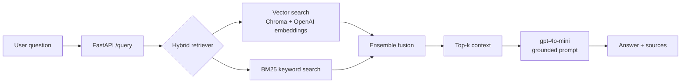

# GroundedRAG - a *measured* retrieval-augmented QA system

A document question-answering system that retrieves relevant context and generates
grounded, cited answers. Unlike most RAG demos, the focus here is **evaluation**:
every retrieval and tuning decision is backed by measured metrics on a 50-question
golden set, with a full experiment log.

**Live demo:** https://rag-assistant-u985.onrender.com/docs
*(free tier - the first request after idle may take 30–60s to wake)*

---

## Why this project is different

Anyone can wire up "load docs → embed → retrieve → generate." The harder, rarer
part is knowing whether it actually works. This project includes:

- An **evaluation harness** with retrieval metrics (recall@k, precision@k, MRR)
  and an **LLM-as-judge** scoring answer correctness and faithfulness.
- A **50-question golden set** with verified reference answers and expected sources.
- A **measured tuning journey** - retriever, k, chunk size, and hybrid/reranking
  strategies were each chosen by experiment, not by guesswork
  (see [`eval/experiment_log.md`](eval/experiment_log.md)).
- **User-selectable multi-source grounding** (docs / web / both) with a simple
  frontend, mirroring how production assistants (Gemini, ChatGPT) expose web
  search as a user control.
- **Production ingestion pipeline** - incremental (hash-based) indexing behind an
  async Celery + Redis task queue, so large corpora re-index efficiently without
  blocking the API.

## Architecture



Retrieval combines dense (vector) and sparse (BM25 keyword) search via ensemble
fusion. Locally, an optional cross-encoder reranker further refines results; the
deployed build uses the lighter hybrid config (see [Deployment](#deployment)).

## Evaluation results

All metrics on the 50-question golden set (`openai` embeddings, `gpt-4o-mini`).

**Retrieval strategies compared:**

| strategy         | recall@k | precision@k | MRR   |
|------------------|----------|-------------|-------|
| vector (k=3)     | 0.960    | 0.820       | 0.917 |
| hybrid           | 1.000    | 0.747       | 0.950 |
| rerank           | 0.980    | 0.800       | 0.933 |
| **hybrid+rerank**| **1.000**| **0.820**   | **0.943** |

Hybrid search buys recall (its keyword half catches exact-term queries vector
search misses); the reranker buys back the precision that hybrid alone sacrifices.
Together they dominate every single-strategy configuration.

**Answer quality (LLM-as-judge, 1–5):** correctness **4.38**, faithfulness **4.56**.
Faithfulness ≥ correctness indicates answers are grounded in retrieved context
rather than the model's own knowledge.

**Tuning journey:**

| stage                  | recall | precision | MRR   |
|------------------------|--------|-----------|-------|
| baseline (vector, k=4) | 0.960  | 0.775     | 0.917 |
| → k=3                  | 0.960  | 0.820     | 0.917 |
| → hybrid+rerank        | 1.000  | 0.820     | 0.943 |

**Scaling to a two-domain corpus (FastAPI + ~29 Kubernetes docs, 6x larger):**

| evaluation                        | recall | precision | MRR   |
|-----------------------------------|--------|-----------|-------|
| FastAPI (before expansion, k=3)   | 0.960  | 0.820     | 0.917 |
| FastAPI (after expansion, k=3)    | 0.960  | 0.787     | 0.927 |
| Kubernetes domain (26 Qs, k=3)    | 0.942  | 0.872     | 0.936 |

Expanding the corpus 6x cost only 0.03 precision on the original FastAPI
questions - the two domains separate cleanly in embedding space, so cross-domain
distractors rarely displace the correct chunk. The new Kubernetes domain (with a
dedicated 26-question golden set including multi-doc questions) evaluates strongly
on its own. Answer quality: FastAPI 4.80/4.84, Kubernetes 5.00/5.00
(correctness/faithfulness, LLM-as-judge).

## Multi-source grounding

The answer's grounding source is **user-selectable** per request - via a toggle
in the frontend or a `source` field on `/query`:

- **docs** - local corpus only (hybrid vector + BM25)
- **web** - live web search only (Tavily)
- **both** - docs + web fused

This mirrors how Gemini and ChatGPT expose web grounding as a user control,
rather than hiding it behind an automatic router. The rationale: the user knows
their intent better than a router can infer it, there is no mis-route failure
mode, and it is fully transparent.

**Measured on 10 questions that require current/web info not in the corpus:**

| mode | answered | faithfulness | url sources |
|------|----------|--------------|-------------|
| docs | 0.20     | 5.00         | 0.00        |
| web  | 0.90     | 5.00         | 1.00        |
| both | 0.80     | 5.00         | 1.00        |

On questions whose answers are not in the corpus, docs-only grounding correctly
**refuses** (grounded behavior, not hallucination), while web grounding answers
with cited URLs. Faithfulness stays at 5.00 across all modes - the system never
fabricates beyond what it retrieved. (Web answers are only as accurate as the
underlying search results, which is an inherent limitation of web grounding.)

This is the open-source, user-controlled analogue of the "expanding grounding
choice" pattern described in
[Google's Gemini Enterprise grounding announcement](https://developers.googleblog.com/expanding-choice-in-gemini-enterprise-agent-platform-introducing-grounding-with-parallel-web-search/).

## Ingestion pipeline

Ingestion is built as a production-style pipeline rather than a one-off script:

- **Incremental indexing** - each source file is content-hashed; only new or
  changed files are re-embedded and deleted files are pruned. Re-indexing an
  unchanged corpus embeds nothing.
- **Async task queue** - `POST /ingest` enqueues a job on Redis and returns a
  task id immediately; a separate Celery worker runs the incremental ingest with
  retries, and `GET /ingest/status/{id}` reports progress. This decouples slow
  ingestion from the request/response cycle and scales horizontally (add workers).

```
POST /ingest -> Redis (broker) -> Celery worker -> incremental index
                                                     (hash manifest, per-file)
```

The corpus spans FastAPI documentation and ~29 Kubernetes concept docs
(distributed-systems material), large enough that incremental + async ingestion
is a real efficiency win rather than over-engineering.

## Structured knowledge (OKF)

Implemented Google's Open Knowledge Format (OKF, 2026) - atomic Markdown entries
with YAML frontmatter (id, category, confidence, source) - as a separate,
metadata-tagged collection, enabling retrieval that filters by category or
confidence (via Chroma where-clauses) *before* semantic ranking.

Measured honestly against the raw-doc corpus, OKF *underperformed* at small scale
(4 short entries cluster tightly in embedding space, hurting ranking). This is
logged as a rigorous negative result: OKF's value is scale- and metadata-driven,
not automatic - structure alone doesn't help until there are many entries per
category to filter across. OKF complements RAG (it standardizes knowledge); it
does not replace retrieval.

## Tech stack

- **API:** FastAPI, Uvicorn
- **Orchestration:** LangChain (`langchain`, `-openai`, `-chroma`, `-community`, `-classic`)
- **Vector store:** ChromaDB (persistent)
- **Embeddings:** OpenAI `text-embedding-3-small` (compared against local
  HuggingFace `all-MiniLM-L6-v2`)
- **Generation:** OpenAI `gpt-4o-mini`
- **Keyword search:** BM25 (`rank-bm25`)
- **Web grounding:** Tavily search API
- **Pipeline:** Celery + Redis (async task queue), content-hash incremental indexing
- **Structured knowledge:** OKF (Open Knowledge Format) with metadata-filtered retrieval
- **Reranker (local):** cross-encoder `ms-marco-MiniLM-L-6-v2`
- **Deploy:** Docker, Render
- **Tooling:** `uv`

## Project structure

```
rag-assistant/
├── app/
│   ├── ingest.py            # load → chunk → embed → store (+ startup indexing)
│   ├── rag.py               # retrievers, LLM, prompt, answer pipeline
│   ├── main.py              # FastAPI app (/query, /health, /ingest, / frontend)
│   ├── tasks.py             # Celery task queue (async ingestion)
│   └── okf.py               # OKF (Open Knowledge Format) loader
├── data/                    # corpus: markdown, PDF, HTML
├── eval/
│   ├── golden.json          # 50-question golden set
│   ├── retrieval_eval.py    # recall@k, precision@k, MRR
│   ├── answer_eval.py       # LLM-as-judge (correctness, faithfulness)
│   ├── chunk_sweep.py       # chunk-size experiment
│   ├── retriever_compare.py # vector vs hybrid vs rerank
│   ├── web_eval.py          # docs vs web vs both grounding
│   ├── web_golden.json      # web-requiring question set
│   ├── k8s_golden.json      # Kubernetes domain question set
│   ├── okf_compare.py       # raw vs OKF retrieval comparison
│   └── experiment_log.md    # full record of every experiment
├── Dockerfile
├── requirements-deploy.txt
└── README.md
```

## Run locally

Requires Python 3.12+ and an OpenAI API key.

```bash
# install deps (uv)
uv sync

# set your key
echo "OPENAI_API_KEY=sk-..." > .env

# build the index from the corpus
uv run python -m app.ingest

# run the API
uv run python -m uvicorn app.main:app --reload
```

Open http://127.0.0.1:8000/ for the frontend (prompt box + docs/web/both
toggle), or http://127.0.0.1:8000/docs for the API.

For web grounding, add a Tavily key: `echo "TAVILY_API_KEY=tvly-..." >> .env`
(without it, web/both modes fall back to docs).

**Run the evaluation:**

```bash
uv run python -m eval.retrieval_eval          # retrieval metrics
uv run python -m eval.answer_eval             # answer quality (LLM-as-judge)
uv run python -m eval.retriever_compare       # compare retrieval strategies
```

The retriever strategy is selectable via the `RETRIEVER` env var:
`hybrid` (default), `hybrid_rerank` (best, needs PyTorch), or `vector`.

## Deployment

Deployed on Render's free tier as a Docker service. The build uses the **light
hybrid config** (vector + BM25, no reranker) because the cross-encoder reranker
pulls in PyTorch (~1GB+ RAM), which exceeds free-tier limits. This is a deliberate
tradeoff: hybrid alone keeps recall at 1.000 and MRR at 0.950, sacrificing only
precision (0.747 vs 0.820) relative to the full reranked config.

The container ships without a pre-built vector DB; it indexes the corpus on
startup (`ensure_indexed`), so the deployed vectors always match the committed
corpus. On free tier the service sleeps when idle, so the first request after a
cold start also rebuilds the index (a few seconds, one small embedding call).

## Limitations & what I'd change at scale

- **Small corpus.** The corpus is intentionally small (a handful of docs), so
  recall saturates early and k=3 maximizes precision at no recall cost. On a large
  corpus, recall would climb with k and k would become a genuine recall/precision
  tradeoff.
- **Eval-set size.** 50 questions is enough to see directional effects but noisy
  on small differences; the model comparison ranking actually flipped between 25
  and 50 questions, underscoring why eval-set size matters.
- **At scale** I'd move to a managed vector DB (Qdrant/pgvector) with proper
  metadata filtering, serve the reranker as a separate resourced service (or use a
  hosted rerank API), cache the BM25 index and model loads, and add request
  tracing and retrieval-quality monitoring in production.
