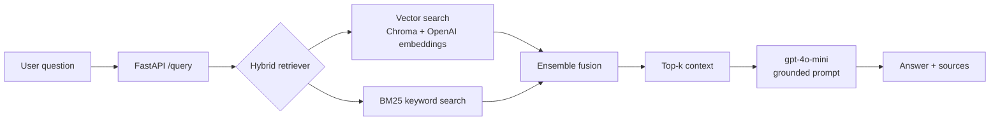

# RAG Assistant - a *measured* retrieval-augmented QA system

A document question-answering system that retrieves relevant context and generates
grounded, cited answers. Unlike most RAG demos, the focus here is **evaluation**:
every retrieval and tuning decision is backed by measured metrics on a 50-question
golden set, with a full experiment log.

**Live demo:** https://rag-assistant-u985.onrender.com/docs
*(free tier - the first request after idle may take 30–60s to wake)*

---

## Why this project is different

Anyone can wire up "load docs → embed → retrieve → generate." The harder, rarer
part is knowing whether it actually works. This project includes:

- An **evaluation harness** with retrieval metrics (recall@k, precision@k, MRR)
  and an **LLM-as-judge** scoring answer correctness and faithfulness.
- A **50-question golden set** with verified reference answers and expected sources.
- A **measured tuning journey** - retriever, k, chunk size, and hybrid/reranking
  strategies were each chosen by experiment, not by guesswork
  (see [`eval/experiment_log.md`](eval/experiment_log.md)).

## Architecture



Retrieval combines dense (vector) and sparse (BM25 keyword) search via ensemble
fusion. Locally, an optional cross-encoder reranker further refines results; the
deployed build uses the lighter hybrid config (see [Deployment](#deployment)).

## Evaluation results

All metrics on the 50-question golden set (`openai` embeddings, `gpt-4o-mini`).

**Retrieval strategies compared:**

| strategy         | recall@k | precision@k | MRR   |
|------------------|----------|-------------|-------|
| vector (k=3)     | 0.960    | 0.820       | 0.917 |
| hybrid           | 1.000    | 0.747       | 0.950 |
| rerank           | 0.980    | 0.800       | 0.933 |
| **hybrid+rerank**| **1.000**| **0.820**   | **0.943** |

Hybrid search buys recall (its keyword half catches exact-term queries vector
search misses); the reranker buys back the precision that hybrid alone sacrifices.
Together they dominate every single-strategy configuration.

**Answer quality (LLM-as-judge, 1–5):** correctness **4.38**, faithfulness **4.56**.
Faithfulness ≥ correctness indicates answers are grounded in retrieved context
rather than the model's own knowledge.

**Tuning journey:**

| stage                  | recall | precision | MRR   |
|------------------------|--------|-----------|-------|
| baseline (vector, k=4) | 0.960  | 0.775     | 0.917 |
| → k=3                  | 0.960  | 0.820     | 0.917 |
| → hybrid+rerank        | 1.000  | 0.820     | 0.943 |

## Tech stack

- **API:** FastAPI, Uvicorn
- **Orchestration:** LangChain (`langchain`, `-openai`, `-chroma`, `-community`, `-classic`)
- **Vector store:** ChromaDB (persistent)
- **Embeddings:** OpenAI `text-embedding-3-small` (compared against local
  HuggingFace `all-MiniLM-L6-v2`)
- **Generation:** OpenAI `gpt-4o-mini`
- **Keyword search:** BM25 (`rank-bm25`)
- **Reranker (local):** cross-encoder `ms-marco-MiniLM-L-6-v2`
- **Deploy:** Docker, Render
- **Tooling:** `uv`

## Project structure

```
rag-assistant/
├── app/
│   ├── ingest.py            # load → chunk → embed → store (+ startup indexing)
│   ├── rag.py               # retrievers, LLM, prompt, answer pipeline
│   └── main.py              # FastAPI app (/query, /health)
├── data/                    # corpus: markdown, PDF, HTML
├── eval/
│   ├── golden.json          # 50-question golden set
│   ├── retrieval_eval.py    # recall@k, precision@k, MRR
│   ├── answer_eval.py       # LLM-as-judge (correctness, faithfulness)
│   ├── chunk_sweep.py       # chunk-size experiment
│   ├── retriever_compare.py # vector vs hybrid vs rerank
│   └── experiment_log.md    # full record of every experiment
├── Dockerfile
├── requirements-deploy.txt
└── README.md
```

## Run locally

Requires Python 3.12+ and an OpenAI API key.

```bash
# install deps (uv)
uv sync

# set your key
echo "OPENAI_API_KEY=sk-..." > .env

# build the index from the corpus
uv run python -m app.ingest

# run the API
uv run python -m uvicorn app.main:app --reload
```

Open http://127.0.0.1:8000/docs and try `POST /query`.

**Run the evaluation:**

```bash
uv run python -m eval.retrieval_eval          # retrieval metrics
uv run python -m eval.answer_eval             # answer quality (LLM-as-judge)
uv run python -m eval.retriever_compare       # compare retrieval strategies
```

The retriever strategy is selectable via the `RETRIEVER` env var:
`hybrid` (default), `hybrid_rerank` (best, needs PyTorch), or `vector`.

## Deployment

Deployed on Render's free tier as a Docker service. The build uses the **light
hybrid config** (vector + BM25, no reranker) because the cross-encoder reranker
pulls in PyTorch (~1GB+ RAM), which exceeds free-tier limits. This is a deliberate
tradeoff: hybrid alone keeps recall at 1.000 and MRR at 0.950, sacrificing only
precision (0.747 vs 0.820) relative to the full reranked config.

The container ships without a pre-built vector DB; it indexes the corpus on
startup (`ensure_indexed`), so the deployed vectors always match the committed
corpus. On free tier the service sleeps when idle, so the first request after a
cold start also rebuilds the index (a few seconds, one small embedding call).

## Limitations & what I'd change at scale

- **Small corpus.** The corpus is intentionally small (a handful of docs), so
  recall saturates early and k=3 maximizes precision at no recall cost. On a large
  corpus, recall would climb with k and k would become a genuine recall/precision
  tradeoff.
- **Eval-set size.** 50 questions is enough to see directional effects but noisy
  on small differences; the model comparison ranking actually flipped between 25
  and 50 questions, underscoring why eval-set size matters.
- **At scale** I'd move to a managed vector DB (Qdrant/pgvector) with proper
  metadata filtering, serve the reranker as a separate resourced service (or use a
  hosted rerank API), cache the BM25 index and model loads, and add request
  tracing and retrieval-quality monitoring in production.